# Sistema Distribuido de Gestión de Turnos basado en Microservicios

# Descripción general del proyecto

El presente proyecto consiste en el desarrollo de un sistema distribuido para la gestión de turnos utilizando una arquitectura basada en microservicios.

El objetivo principal del sistema es permitir el registro de usuarios, la asignación automática de turnos y la generación de notificaciones, implementando mecanismos de comunicación distribuida entre múltiples servicios desacoplados.

La solución fue desarrollada aplicando los conceptos trabajados durante el curso de Sistemas Distribuidos, incluyendo:

* Arquitectura de microservicios
* Comunicación HTTP entre servicios
* API Gateway
* Persistencia desacoplada
* Contenerización con Docker
* Tolerancia a fallos
* Circuit Breaker
* Monitoreo básico
* Logs distribuidos
* Recuperación de servicios

El sistema busca simular un entorno distribuido real, donde cada componente tiene responsabilidades independientes y puede escalar o fallar de forma aislada sin afectar completamente el funcionamiento global de la aplicación.

---

# Problemática abordada

En muchos sistemas tradicionales de gestión de turnos, toda la lógica de negocio se encuentra centralizada en una única aplicación monolítica, lo que genera dificultades relacionadas con:

* mantenimiento del sistema
* escalabilidad
* tolerancia a fallos
* despliegues independientes
* monitoreo
* actualización de funcionalidades

Para solucionar esta problemática, el proyecto implementa una arquitectura distribuida basada en microservicios, permitiendo desacoplar las funcionalidades del sistema en servicios independientes que se comunican mediante HTTP.

De esta manera, si uno de los servicios presenta fallos, los demás componentes continúan funcionando parcialmente gracias a los mecanismos de resiliencia implementados.

---

# Objetivos del sistema

## Objetivo general

Desarrollar un sistema distribuido de gestión de turnos utilizando arquitectura de microservicios, aplicando mecanismos de comunicación, monitoreo y tolerancia a fallos.

## Objetivos específicos

* Implementar microservicios desacoplados
* Gestionar usuarios y turnos
* Integrar servicios mediante HTTP
* Persistir información utilizando PostgreSQL
* Contenerizar el sistema mediante Docker
* Aplicar el patrón Circuit Breaker
* Implementar monitoreo básico y logs
* Validar recuperación de servicios

---

# Arquitectura del sistema

El sistema se encuentra compuesto por múltiples microservicios independientes que se comunican mediante solicitudes HTTP.

Cada servicio implementa una responsabilidad específica dentro del sistema distribuido.

## Componentes implementados

* gateway-service
* users-service
* turns-service
* notifications-service
* reports-service
* PostgreSQL

---

# Explicación de servicios

## Gateway Service

El Gateway Service actúa como punto de entrada principal del sistema distribuido.

Su responsabilidad consiste en recibir las solicitudes del cliente y redireccionarlas hacia los diferentes microservicios internos.

Esto permite centralizar el acceso al sistema y desacoplar al cliente de la arquitectura interna.

### Funciones principales

* Redireccionamiento de solicitudes
* Comunicación entre cliente y servicios
* Validación básica de disponibilidad
* Control centralizado de acceso

### Endpoints

```bash id="1jfd9w"
GET  /
GET  /health
GET  /users
POST /users
GET  /turns
POST /turn
GET  /notifications
POST /notify
```

---

## Users Service

El Users Service administra el registro y almacenamiento de usuarios dentro del sistema.

Implementa validaciones básicas y persistencia independiente en PostgreSQL.

### Funciones principales

* Registro de usuarios
* Consulta de usuarios
* Validación de datos
* Persistencia de información

### Endpoints

```bash id="09jfsd"
GET  /users
POST /users
GET  /health
```

---

## Turns Service

El Turns Service es responsable de generar automáticamente los turnos de atención.

Este servicio implementa integración distribuida con Users Service y Notifications Service.

### Funciones principales

* Generación automática de turnos
* Validación de usuarios existentes
* Comunicación entre servicios
* Registro de turnos

### Endpoints

```bash id="1jvda3"
GET  /turns
POST /turn
GET  /health
```

---

## Notifications Service

El Notifications Service administra las notificaciones asociadas a los turnos generados.

Este servicio almacena el historial de notificaciones enviadas.

### Funciones principales

* Registro de notificaciones
* Consulta de notificaciones
* Persistencia independiente
* Comunicación distribuida

### Endpoints

```bash id="p9s0d1"
GET  /notifications
POST /notify
GET  /health
```

---

## Reports Service

El Reports Service consolida información distribuida, implementa Circuit Breaker y almacena historial de reportes

### Funciones principales

* Consolidación de información
* Integración distribuida
* Monitoreo básico
* Tolerancia a fallos
* Recuperación automática

### Endpoints

```bash id="1jdas9"
GET /reports
POST /reports
GET /reports/history
GET /health
```

---

# Comunicación distribuida

La comunicación entre servicios se realiza mediante solicitudes HTTP utilizando la librería Requests.

## Flujo principal

* Cliente → Gateway
* Gateway → Users Service
* Gateway → Turns Service
* Turns Service → Users Service
* Turns Service → Notifications Service
* Reports Service → Todos los servicios

Esto permite desacoplar responsabilidades y distribuir la carga funcional entre múltiples componentes independientes.

---

# Persistencia de datos

Cada servicio implementa persistencia utilizando PostgreSQL.

El sistema utiliza Docker Volumes para mantener la información almacenada incluso cuando los contenedores son reiniciados.

## Bases de datos utilizadas

* users_db
* turns_db
* notifications_db
* reports_db

---

# Contenerización

El sistema se ejecuta completamente mediante Docker Compose.

Cada microservicio cuenta con:

* Dockerfile independiente
* comunicación interna mediante red Docker
* reinicio automático
* despliegue desacoplado

Esto facilita la portabilidad y ejecución del sistema en diferentes entornos.

---

# Tecnologías utilizadas

* Python
* Flask
* PostgreSQL
* Docker
* Docker Compose
* Requests
* Psycopg2

---

# Health Checks y monitoreo

El sistema implementa endpoints `/health` para validar disponibilidad de cada microservicio.

Además, se implementan logs distribuidos para monitorear:

* solicitudes
* errores
* disponibilidad
* recuperación de servicios
* fallos de comunicación

---

# Tolerancia a fallos

El proyecto implementa el patrón Circuit Breaker dentro del Reports Service.

## Estados implementados

### CLOSED

Estado normal de funcionamiento donde las solicitudes son procesadas correctamente.

### OPEN

Cuando múltiples solicitudes fallan consecutivamente, el circuito se abre para evitar seguir consumiendo recursos sobre servicios caídos.

### HALF-OPEN

Después de un tiempo de recuperación, el sistema prueba nuevamente la disponibilidad del servicio antes de cerrar completamente el circuito.

---

# Recuperación de servicios

La recuperación se valida utilizando:

```bash id="19jda1"
docker stop
docker start
```

De esta manera se simulan fallos reales dentro de la arquitectura distribuida.

---

# Variables de entorno

El proyecto utiliza variables de entorno para desacoplar información sensible de la configuración del sistema.

## Archivo `.env.example`

```env id="91jda8"
DB_HOST=db
DB_USER=admin
DB_PASSWORD=admin
```

---

# Instrucciones de ejecución

## 1. Clonar repositorio

```bash id="1hfd73"
git clone URL_DEL_REPOSITORIO
```

---

## 2. Ingresar al proyecto

```bash id="18hfs8"
cd gestor-turnos
```

---

## 3. Levantar contenedores

```bash id="19jfd8"
docker-compose up --build
```

---

## 4. Crear bases de datos

```bash id="8jfd11"
docker exec -it postgres_db psql -U admin -d postgres
```

Ejecutar:

```sql id="1jd881"
CREATE DATABASE users_db;
CREATE DATABASE turns_db;
CREATE DATABASE notifications_db;
CREATE DATABASE reports_db;
```

---

# Evidencias del sistema

## Fase 1 - Arquitectura

### Docker funcionando

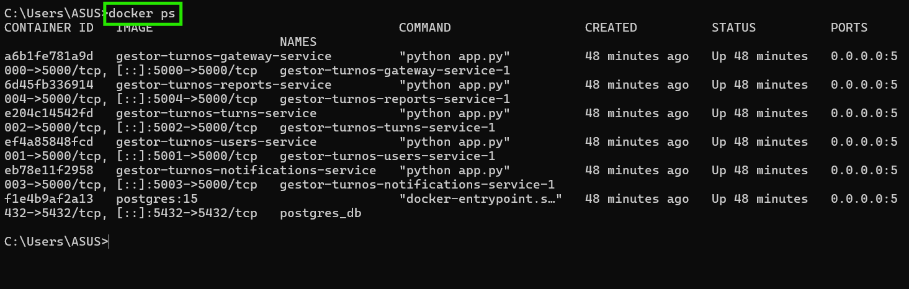

### Gateway activo

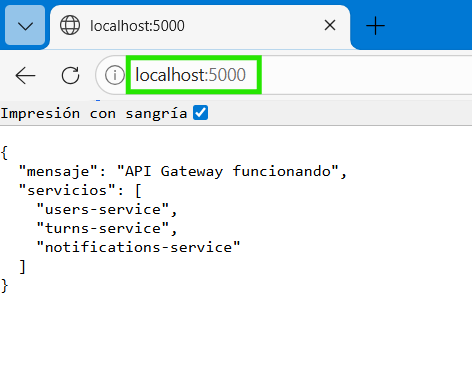

---

## Fase 2 - Funcionamiento

### Health checks de microservicios

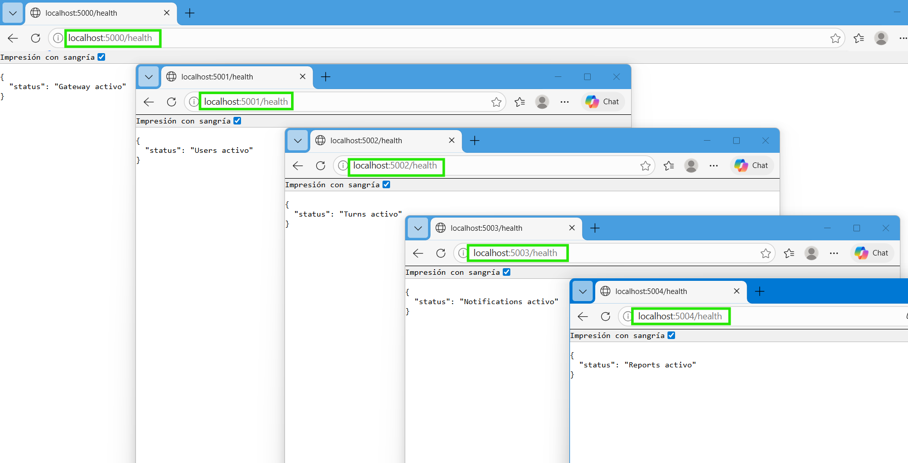

---

## Fase 3 - Integración entre servicios

### Registro de usuario

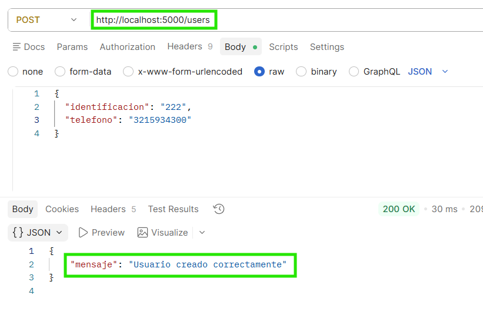

### Generación de turno

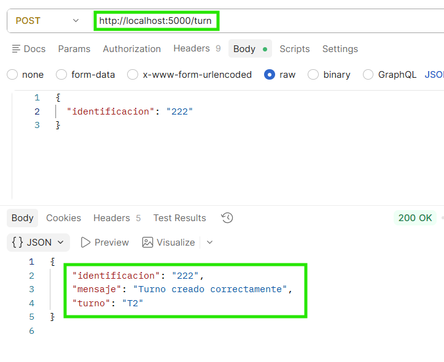

### Notificaciones generadas

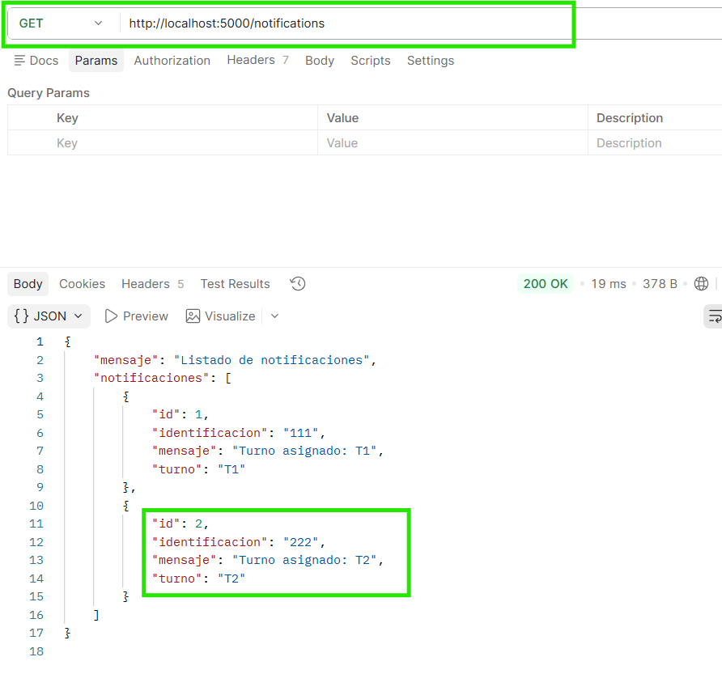

### Consolidación de información

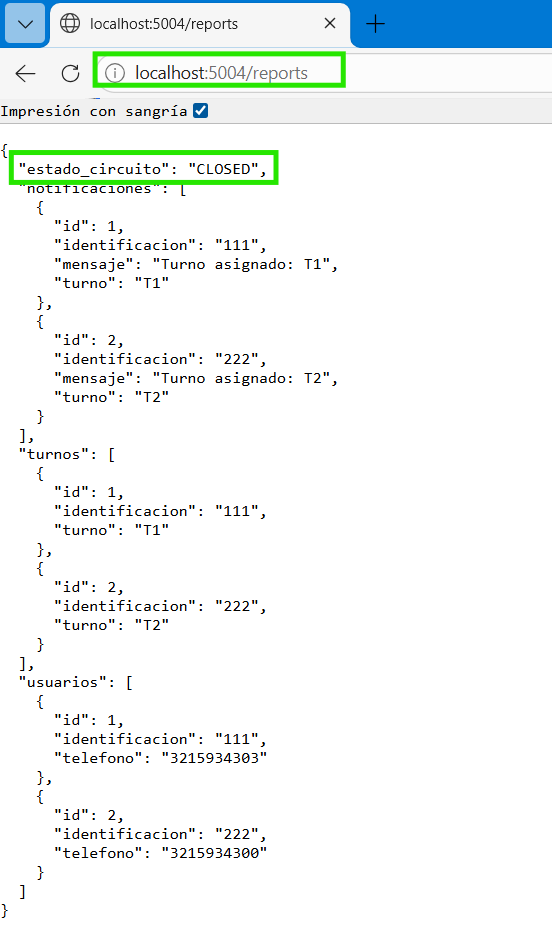

---

## Fase 4 - Monitoreo

### Logs distribuidos del sistema

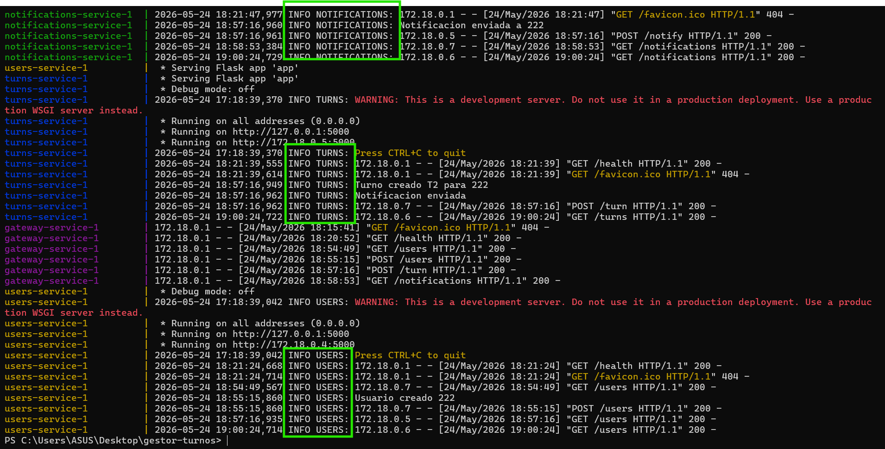

---

## Fase 5 - Circuit Breaker

### Simulación de fallo

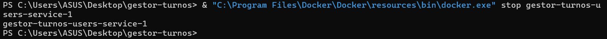

### Circuito abierto

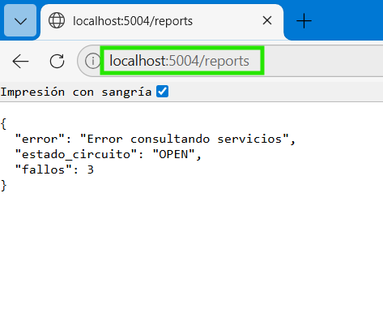

### Logs del Circuit Breaker

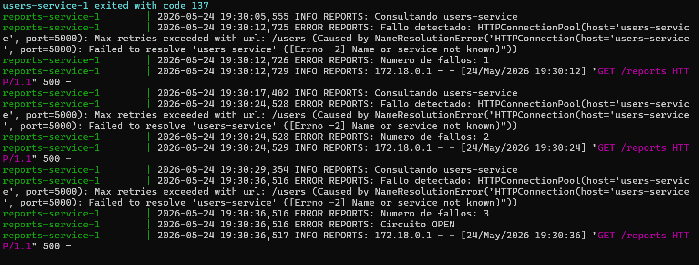

---

## Fase 6 - Recuperación

### Recuperación del servicio

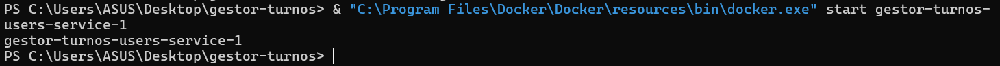

### Circuito restablecido

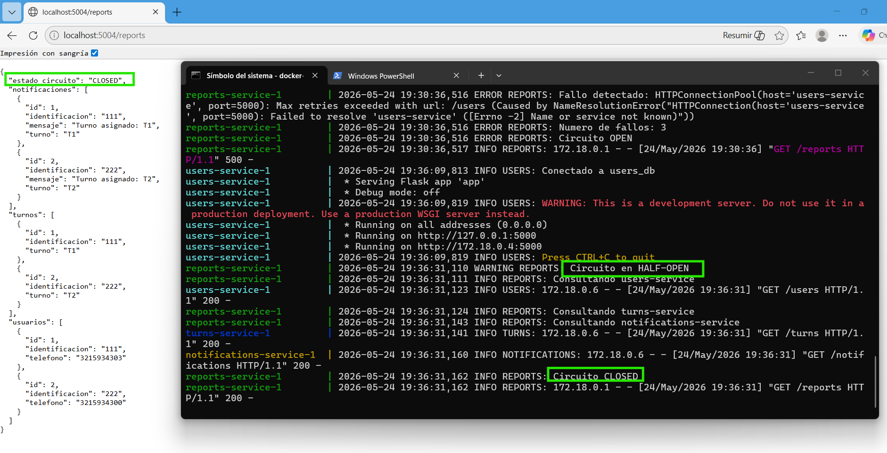

---

# Escalabilidad futura

Como trabajo futuro, el sistema podría implementar:

* balanceo de carga
* Kubernetes
* autenticación JWT
* monitoreo avanzado con Prometheus y Grafana
* mensajería asíncrona
* API Gateway avanzado
* escalamiento horizontal

---

# Conclusiones

La implementación del sistema permitió aplicar los principales conceptos de Sistemas Distribuidos mediante una arquitectura desacoplada basada en microservicios.

Se logró validar:

* comunicación distribuida
* persistencia desacoplada
* monitoreo básico
* tolerancia a fallos
* recuperación de servicios
* integración entre componentes

El proyecto demuestra cómo una arquitectura distribuida permite construir sistemas más resilientes, escalables y mantenibles frente a arquitecturas monolíticas tradicionales.
